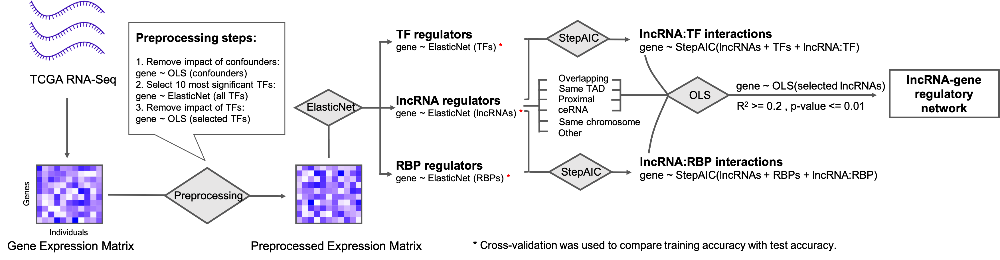

# lncRNARN

Xiaoman Xie [xiaoman2@illinois.edu] and Saurabh Sinha [saurabh.sinha@bme.gatech.edu]

University of Illinois Urbana-Champaign
Georgia Institute of Technology

This repository provides script and data to repeat analyses performed in the paper "Quantitative estimates of the regulatory influence of long non-coding RNAs on global gene expression variation using TCGA breast cancer transcriptomic data".

In this work, we analyzed the transcriptome data for 13,963 protein coding genes and 1,079 lncRNAs of 1,217 breast cancer tumor samples from TCGA. We assessed how much variance of the gene expression can be explained by lncRNAs using linear regression models that treat expression values of selected lncRNAs as independent variables. Importantly, we accounted for potential confounding effects of TFs as common regulators of a co-expressed lncRNA-mRNA pair in performing the regression analysis. We repeated the analysis using lncRNAs that can be potentially associated with the target gene under a specific mechanistic assumption, such as lncRNAs that overlap the gene, or lncRNAs that are located in the same Topologically Associating Domain (TAD) as the target gene, or lncRNAs that may compete with the target gene for the same microRNA, i.e., the ceRNA mechanism. In any modeling step where a large number of candidate regulators were possible, we controlled for model complexity by adopting the Elastic Net approach that ensures sparsity of selected features, and by assessing the percentage of expression variance explained in an unseen part of the data set. Statistically significant interactions between lncRNA and RBPs/TFs were detected by first training models to explain the target gene expression using both lncRNAs and the class of proteins, and then assessing the added value of including interaction terms in the model. 

Combining the results of the above-mentioned analyses, we finally created a lncRNA-mRNA regulatory network with edges being lncRNA-mRNA connections that are strongly supported by the above models and by additional evidence of a plausible regulatory mechanism.

### Data
Expression profile downloaded from TCGA portal is in file ./data/TCGA_matadata.txt

List of lncRNA Ensembl IDs used in the study: lncRNA.txt

List of protein coding gene Ensembl IDs used in the study: ProteinCodingGene.txt

List of human transcription factors (TF): TF.txt

List of RNA binding proteins (RBP): RBP.txt

### Code
ElasticNetOLS_res.r: Script used to training and select the most significant lncRNA predictor.

OLS_res_Condition.r: Script used to training the full model.
